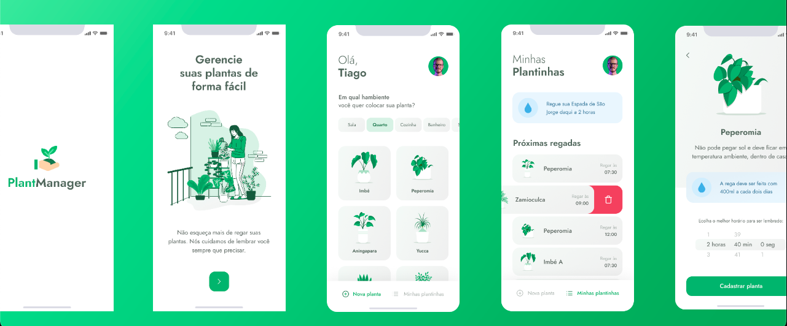

<div align="center">
  
  <h1>PlantManager</h1>
  <p>🌱 Aplicativo para lembrar as pessoas de regar suas plantas 🌱</p>
  
</div>

# 👀 About

Vários lugares usam plantas, seja em casa ou no comércio, e hoje em dia o ser humano está cada vez mais ocupado, então acaba esquecendo de regar as plantas. O Plantmanager veio resolver este problema, com este aplicativo você saberá quando e como regar suas plantas !!

<div align="center">
   
</div>

<br>
<br>


# 🚀 Technologies

  - [Node.js](https://nodejs.org/en/)
  - [Expo](https://expo.io/)  
  - [React Native](https://reactnative.dev/)
  - [TypeScript](https://www.typescriptlang.org/)
  - [ESlint](https://eslint.org/)
  - [Prettier](https://prettier.io/)
  - [EditorConfig](https://editorconfig.org/)


## 💻 Getting started

### Requirements

- [Node.js](https://nodejs.org/en/)
- [Expo](https://expo.io/)  
- [Yarn](https://classic.yarnpkg.com/) or [NPM](https://www.npmjs.com/)

### Installing and running the project

*Clone the project and access the folder*

```bash
$ git clone 
$ cd plantmanager
```

*Follow the steps below*

```bash
# Install the dependencies
$ yarn install

# Make a copy of '.env.example' to '.env'
# and set with YOUR environment variables.
$ cp .env.example .env

# Finally, run the api service in a development environment :)
$ yarn start

# Well done, PlantManager is started!
```
<br>

